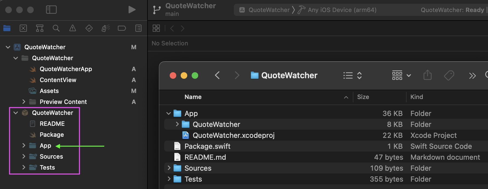

# Supermodular App Scaffolding

Create new Swift Package in terminal

```sh
$ mkdir QuoteWatcher
$ cd QuoteWatcher
$ swift package init
```

Initiate Git and commit

```sh
$ git init
$ git add .
$ git commit -am 'Add basic scaffolding for `QuoteWatcher` Swift Package'
```

Open Xcode, create new `iOS` project `QuoteWatcher` (do not not use Core Data, do not include tests)

<br/>
<div align="center">

</div>
<br/>

Save to `QuoteWatcher` folder (do not add to any project or workspace)

<br/>
<div align="center">

<br/>
</div>
<br/>


Close the project. Back in terminal rename `QuoteWatcher` to `App`

```sh
$ mv QuoteWatcher App
```

Commit

```sh
$ git add .
$ git commit -m 'Create `QuoteWatcher` project'
```

Open the project in the Xcode. Drag the folder `QuoteWatcher` into the project

<br/>
<div align="center">

<br/>
</div>
<br/>

Local Swift Package would be added to Xcode project.

<br/>
<div align="center">

<br/>
</div>
<br/>

We'll handle `App` folder in a moment, but first let's commit changes to the `App/QuoteWatcher.xcodeproj/project.pbxproj` file

```sh
$ git commit -am 'Add Swift Package to Xcode project'
```

Add empty Swift Package to hide `App` folder from the Xcode

```sh
$ cat > App/Package.swift << ENDOFFILE
// swift-tools-version:5.6

// Leave blank. This is only here so that Xcode doesn't display it.

import PackageDescription

let package = Package(
    name: "client",
    products: [],
    targets: []
)
ENDOFFILE
```

Reopen the project in the Xcode. Now the `App` folder is hidden.

<br/>
<div align="center">

<br/>
</div>
<br/>


Commit

```sh
$ git add .
$ git commit -m 'Add empty Swift Package to hide `App` folder from Xcode'
```
