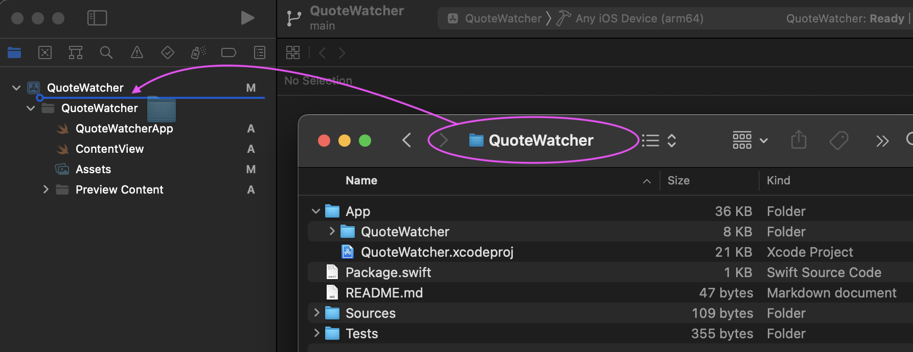

# Supermodular App Scaffolding

Create a new Swift Package in the terminal

```sh
$ mkdir QuoteWatcher
$ cd QuoteWatcher
$ swift package init
```

Initiate Git and commit

```sh
$ git init
$ git add .
$ git commit -am 'Add basic scaffolding for `QuoteWatcher` Swift Package'
```

Open Xcode, create a new `iOS` project `QuoteWatcher` (do not use Core Data, do not include tests)

<br/>
<div align="center">

</div>
<br/>

Save to the `QuoteWatcher` folder (do not add to any project or workspace)

<br/>
<div align="center">

<br/>
</div>
<br/>


Close the project. Back in the terminal rename `QuoteWatcher` to `App`

```sh
$ mv QuoteWatcher App
```

Commit

```sh
$ git add .
$ git commit -m 'Create `QuoteWatcher` project'
```

Open the project in the Xcode. Drag the folder `QuoteWatcher` into the project

<br/>
<div align="center">

<br/>
</div>
<br/>

Local Swift Package would be added to the Xcode project.

<br/>
<div align="center">

<br/>
</div>
<br/>

We'll handle the `App` folder in a moment, but first, let's commit changes to the `App/QuoteWatcher.xcodeproj/project.pbxproj` file

```sh
$ git commit -am 'Add Swift Package to Xcode project'
```

Add an empty Swift Package to hide the `App` folder from the Xcode

__Until syntax lighlighting issue with comments is resolved, use:__

<div>
cat > App/Package.swift << ENDOFFILE

// swift-tools-version:5.6

// Leave blank. This is only here so that Xcode doesn't display it.

import PackageDescription

let package = Package(
    name: "client",
    products: [],
    targets: []
)
ENDOFFILE
</div>

```sh
$ cat > App/Package.swift << ENDOFFILE
// swift-tools-version:5.6

// Leave blank. This is only here so that Xcode doesn't display it.

import PackageDescription

let package = Package(
    name: "client",
    products: [],
    targets: []
)
ENDOFFILE
```

Reopen the project in the Xcode. Now the `App` folder is hidden.

<br/>
<div align="center">

<br/>
</div>
<br/>


Commit

```sh
$ git add .
$ git commit -m 'Add empty Swift Package to hide `App` folder from Xcode'
```

```sh
#!/bin/bash

# Do not forget to make this file executable with `chmod +x the_file_name`

###########################################################################
#
#   Use this script to create super-modular app
#   for details https://igor1309.dev/articles/2022/2022-08-30-supermodular/
#   to run: $ bash supermodular-i.sh
#
###########################################################################

# `set -o pipefail` causes a pipeline (for example,
# `curl -s https://sipb.mit.edu/ | grep foo`) to produce
# a failure return code if any command errors.
# Normally, pipelines only return a failure if the last command errors.
# In combination with `set -e`, this will make your script exit
# if any command in a pipeline errors.
set -eo pipefail

if [ $# -eq 0 ]; then
    echo "Exiting: ❌ no app name provided"
    echo
    exit
fi

size=${#1}

if [ "$size" -lt "5" ]; then
    echo "Exiting: ❌ app name is too short ($size)"
    echo
    exit
fi

echo
read -r -p "❓ Your app name would be: '$1' - Are you sure? [y/N] " response

if [[ "$response" =~ ^([yY][eE][sS]|[yY])$ ]]
then
    echo "Ok, will be creating the app named \`$1\`"
    echo

    mkdir $1
    cd $1
    swift package init

    git init
    git add .
    git commit -am "Add basic scaffolding for \`$1\` Swift Package" --quiet
    git log --oneline

    echo
    echo "🛠"
    echo "Now create project in Xcode."
    read -p "Close Xcode and press [Enter] when done"

    # rename folder to `App`
    mv $1 App

    git add .
    git commit -m "Create \`$1\` project" --quiet --quiet
    git log --oneline

    # preserve indentation to have `Package.swift` nicely formatted
package="// swift-tools-version:5.6

// Leave blank. This is only here so that Xcode doesn\'t display it.

import PackageDescription

let package = Package(
    name: "client",
    products: [],
    targets: []
)"

    echo "$package" > App/Package.swift

    git add .
    git commit -m "Add empty Swift Package to hide \`App\` folder from Xcode" --quiet

    echo "✅ done"
else
    echo "App name was not confirmed ❌"
    echo
fi
```
